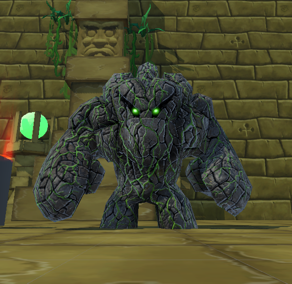
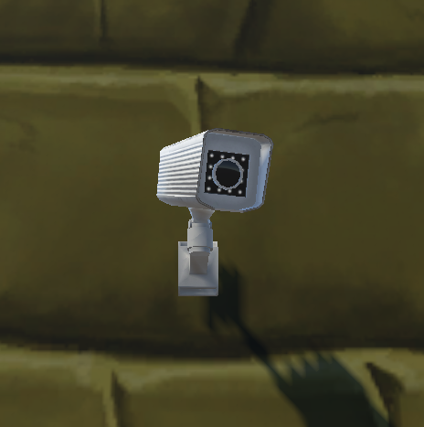

# Stealth Game

## Description

**Stealth Game** where the player plays as someone who wants to steal a precious gem from a temple without being noticed. The player should avoid walking into the camera's or the security guard's (golems) vision cone. The game is going to be level based and in every level the player would get some sort of "level up" while the challenge is going to be harder.

## How to Run

### Download Package

The simplest way to run the game is to download the binary file from one of our releases (Windows or OSX).

### Run using Unity

Another way to run the game is to clone the source code and run it using [Unity](https://unity.com/) on your local machine.

## How to Play

Press `W`, `A`, `S`, `D` to move around.

Hold `SHIFT` to run (your stamina would decrease when you run).

You should try to go to the treasure while avoiding going into the view cone of the guards.

There are 2 type of guards in the game

- **Golem**

  

- **CCTV**

  

There's a light that's attached to every guard to indicate their view cone. The indicator is also visible on the mini map. If you go into the view cone of a guard, it would turn to red. If you stay inside the view cone, you will get caught.

## Note

The original idea was to have a player who wants to steal something from a museum. But during the development process, we realized that there are not really a lot of resources available for this theme. So we decided to change the theme completely and build our "level" scenes from an asset kit that provides building blocks to build dungeons and cartoon style temple environments. We also decided to change the security guard into a golem, to further support the theme we are currently using.

## Assets

- Template Building Kit

  [https://assetstore.unity.com/packages/3d/environments/dungeons/cartoon-temple-building-kit-lite-110397](https://assetstore.unity.com/packages/3d/environments/dungeons/cartoon-temple-building-kit-lite-110397)

- Golem

  [https://assetstore.unity.com/packages/3d/characters/humanoids/fantasy/mini-legion-rock-golem-pbr-hp-polyart-94707](https://assetstore.unity.com/packages/3d/characters/humanoids/fantasy/mini-legion-rock-golem-pbr-hp-polyart-94707)

- Treasure

  [https://assetstore.unity.com/packages/3d/props/simple-gems-ultimate-animated-customizable-pack-73764](https://assetstore.unity.com/packages/3d/props/simple-gems-ultimate-animated-customizable-pack-73764)

- Character

  [https://assetstore.unity.com/packages/3d/characters/toony-tiny-people-demo-113188](https://assetstore.unity.com/packages/3d/characters/toony-tiny-people-demo-113188)

## Gameplay Video

[🔗 Link to gameplay video](https://www.dropbox.com/s/qgdtk2ud4uo6gpm/L0h4OtSmOu.mp4?dl=0#)

## Tutorials Used for This Project

- Tutorial on how to follow a path, how to detect if player wins, for spotting the player and drawing Gizmos: [https://www.youtube.com/watch?v=jUdx_Nj4Xk0&t](https://www.youtube.com/watch?v=jUdx_Nj4Xk0&t)
- Tutorial on how to use Animator: [https://www.youtube.com/watch?v=vApG8aYD5aI&t=283s&ab_channel=iHeartGameDev](https://www.youtube.com/watch?v=vApG8aYD5aI&t=283s&ab_channel=iHeartGameDev)
- Tutorial on how to control the camera using mouse: [https://www.youtube.com/watch?v=_QajrabyTJc&ab_channel=UnityUnityVerified](https://www.youtube.com/watch?v=_QajrabyTJc&ab_channel=UnityUnityVerified)
- Tutorial on how to use Character Controller Component: [https://www.youtube.com/watch?v=4HpC--2iowE](https://www.youtube.com/watch?v=4HpC--2iowE)
- Tutorial on Minimap: [https://www.youtube.com/watch?v=28JTTXqMvOU](https://www.youtube.com/watch?v=28JTTXqMvOU)
- Tutorial on attaching Player to platform: [https://www.youtube.com/watch?v=rO19dA2jksk](https://www.youtube.com/watch?v=rO19dA2jksk)
